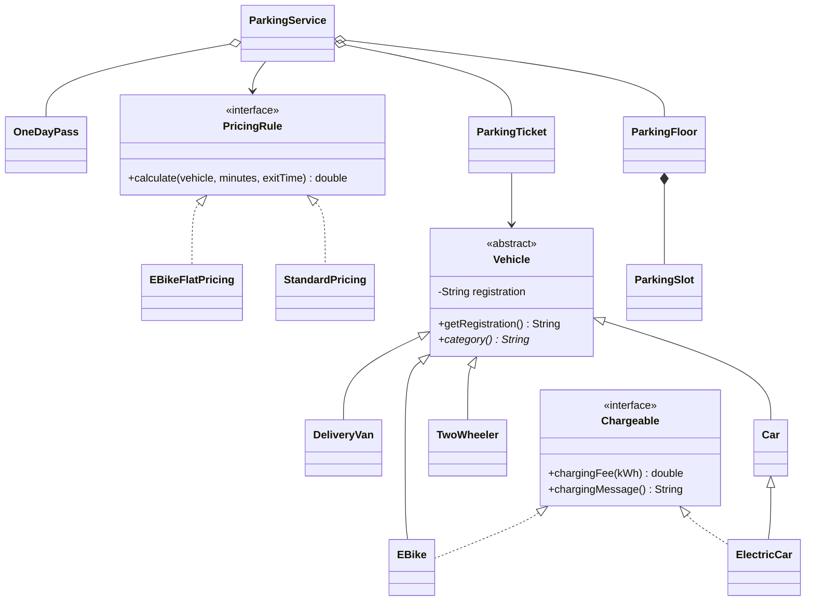

# PARKWISE UML (Mermaid)

```mermaid
classDiagram
  class Vehicle {
    <<abstract>>
    -String registration
    +getRegistration() String
    +category()* String
  }
  class Car
  class TwoWheeler
  class ElectricCar
  class EBike
  class DeliveryVan
  class Chargeable {
    <<interface>>
    +chargingFee(kWh) double
    +chargingMessage() String
  }
  Vehicle <|-- Car
  Vehicle <|-- TwoWheeler
  Car <|-- ElectricCar
  Vehicle <|-- EBike
  Vehicle <|-- DeliveryVan
  Chargeable <|.. ElectricCar
  Chargeable <|.. EBike
  class ParkingFloor
  class ParkingSlot
  class ParkingTicket
  class ParkingService
  class PricingRule {
    <<interface>>
    +calculate(vehicle, minutes, exitTime) double
  }
  class StandardPricing
  class EBikeFlatPricing
  PricingRule <|.. StandardPricing
  PricingRule <|.. EBikeFlatPricing
  ParkingService o-- ParkingFloor
  ParkingFloor *-- ParkingSlot
  ParkingService o-- ParkingTicket
  ParkingTicket --> Vehicle
  ParkingService --> PricingRule
  class OneDayPass
  ParkingService o-- OneDayPass
```
